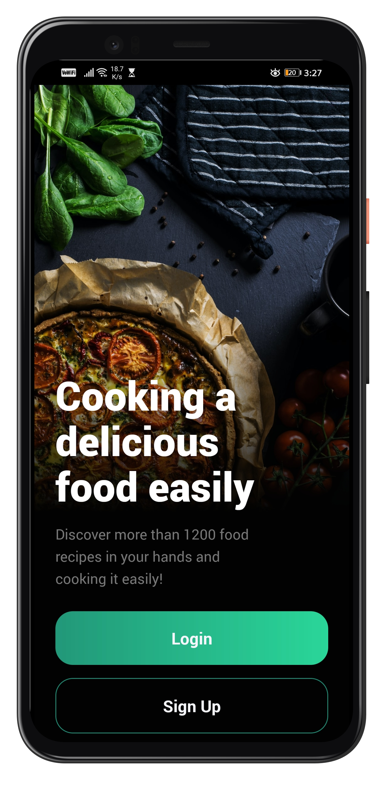
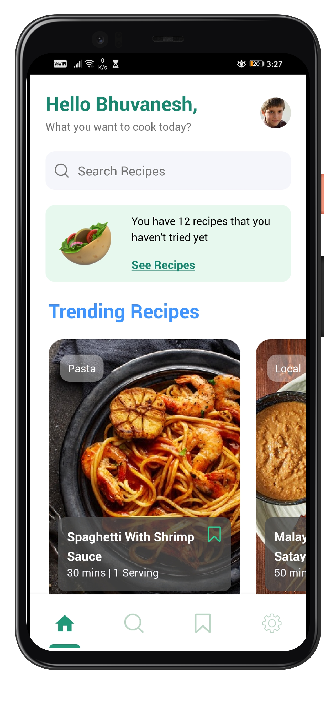
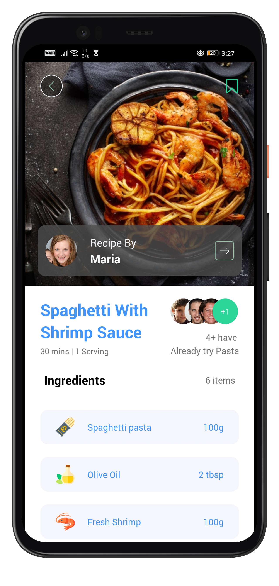

# Recipe App

This is sample project I have created using react native expo-cli to practice my skills.

I have used this video to get resources and help whenever I was stucked -
https://www.youtube.com/watch?v=W-Oqe8Ph_eM

## 📱Image Preview -

  
   
  

## 📱Video Preview -

https://vimeo.com/597712799

### 🛠️Technologies Used -

1 ) React-Native
2 ) Expo cli
3 ) React-navigation

The major challege I faced during development was to implement animations and I got to learn tons about it from this project.
